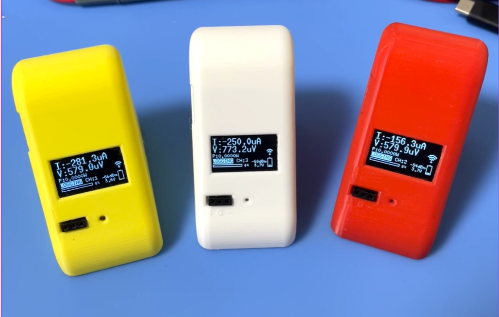
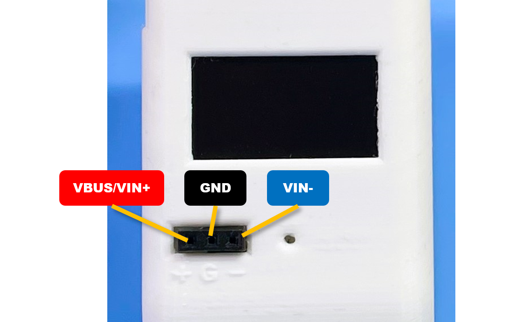
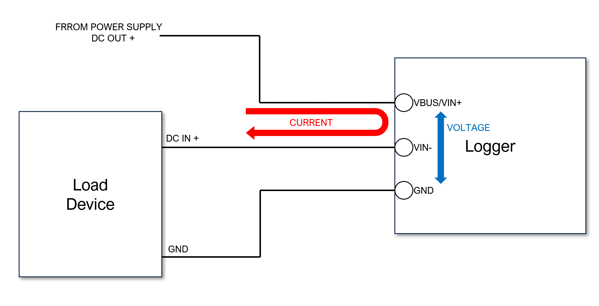
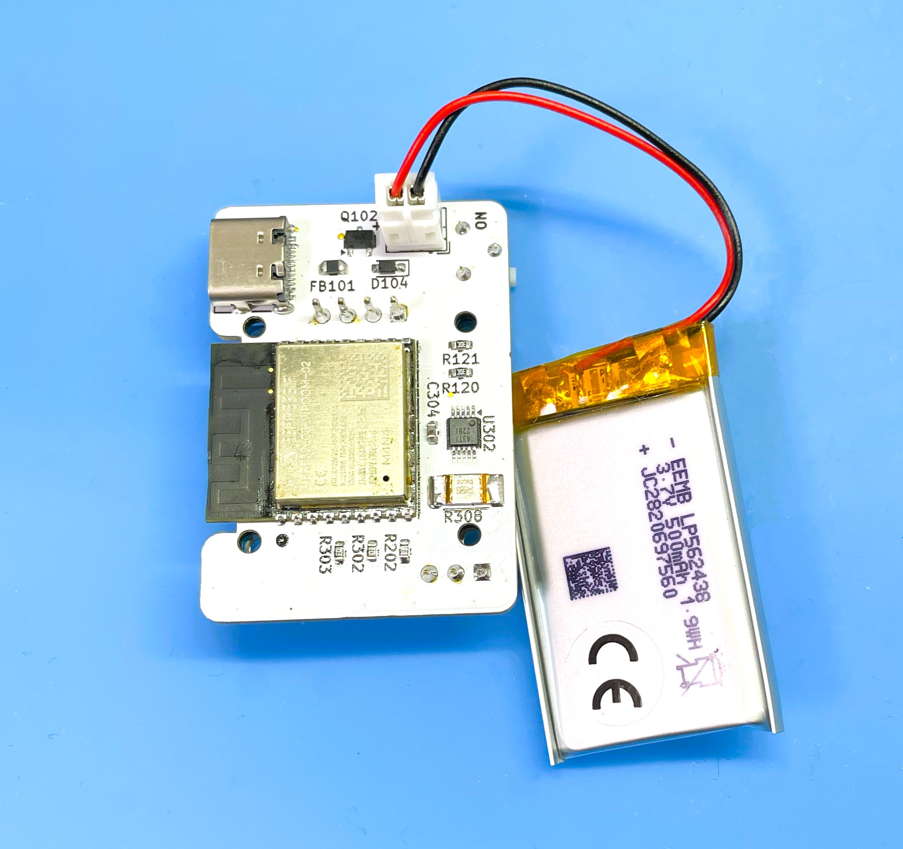
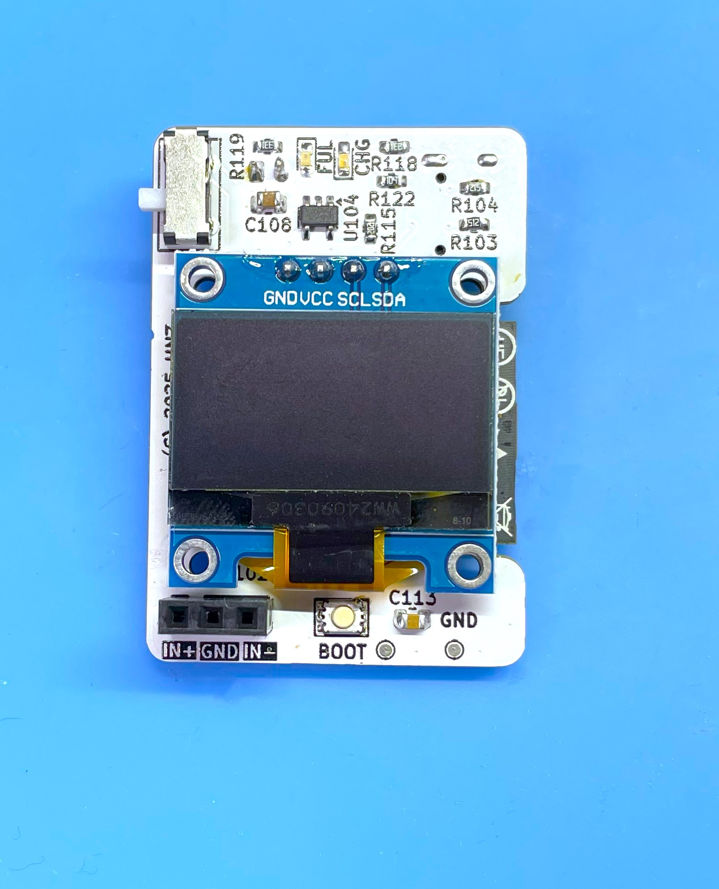
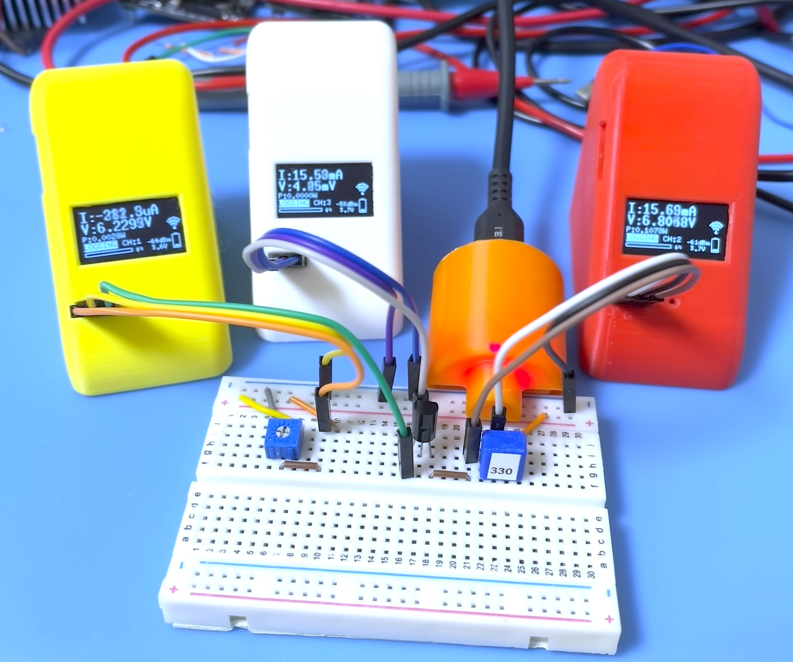
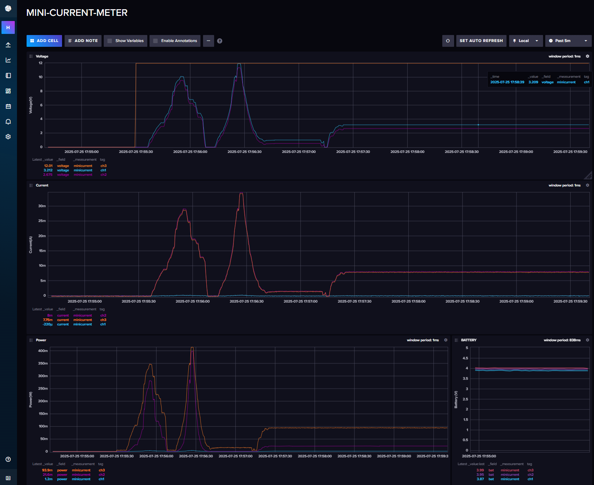
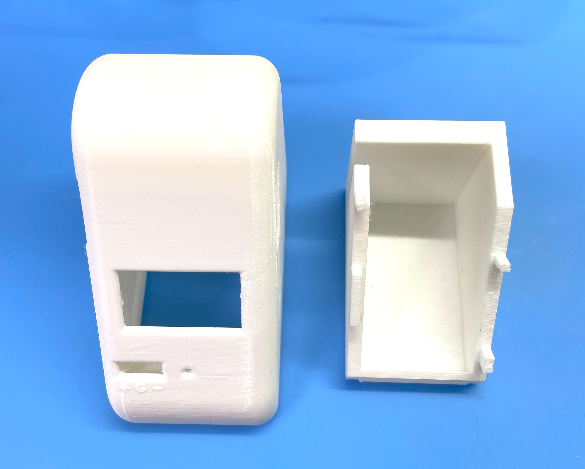

<div align="center">
  <h1><code>Mini Current Meter</code></h1>
  <p>
    
  </p>
</div>

# Mini Current Meter - Mini Size High-resolution digital Power monitor and Logger

This tool provides a logging function that gets data on voltage, current and power consumption. Voltage input range is from 0 to 35V, Maximum current input is 10A. 

# Feature

**High-resolution** - By using Texas Instruments INA228 IC - 20-bit delta-sigma ADC, It can be got measurement data with 195.uV Bus voltage and 163.84mV Shunt voltage. 

**Microcontroller on board** - No need for a client PC when you are measuring. Directly send to the server. 

**Transfer measurement data via WiFi** - This Logger can transfer data to Linux PC via WiFi network and you can see the dashboard graph in influxDB.

**Change Channel** - This logger allow to change the measurement channel by pushing the center button using pin. Once you push the center button, the channel will be changed to the next channel. The channel is changed in the order of 1, 2, 3, 4, and back to 1.

**Battery Powered** - Using LiPo battery. It can run for 12 hours on a single charge. The battery is charged via USB Type-C port.

**Mini Size** - The size is 37mm(W) x 67mm(D) x 55mm(H). It can be used in various places.

# How to use the Logger



This Meter has a pin socket with three pins. VBUS/VIN+, GND, and VIN-. The VBUS/VIN+ pin is connected to the voltage input or the current input. The GND pin is connected to the ground of the voltage or current input. The VIN- pin is connected to the Load side of the voltage or current input.



DO NOT CONNECT WITH OPPOSITE POLARITY BETWEEN VBUS/VIN+ WITH GND. IF CONNECTED, THE ADC IC IS WILL BE DAMAGED.

The measurement interval time fixed as 100ms. Each measurement data is sent to the server every 1 second. 

A display can show you the current voltage, current, power consumption, battery voltage, buffer consumption, WiFi connection status, and channel number.
If the WiFi Access Point cannot establish a connection, the display will not show WiFi mark. If voltage is measured while the WiFi is not connected, the data is stored in the logger's internal memory buffer. The buffer that is not being sent to the server is indicated by a buffer bar line on the display. When the buffer is full (the line reaches the right edge of the display), the measurement stops automatically. Then, when the WiFi is connected and transmitted to the server, the buffer line shrinks to the left. The buffer is full and the measurement is stopped. When after the buffer is less than 50%, the measurement will be resumed automatically.





If you send data to the server, You can see the realtime data using Dashboard by [InfluxDB](https://www.influxdata.com/influxdb/). If you have 3 meters, you can see the data on the dashboard with different channels at the same time.

This meters are small and light, so you can use them in various places. For example, you can use them to measure the circuit current of your breadboard, or you can use them to measure the current of each your circuit measurement point on your breadboard. 





After the measure, to stop logging, push the START button again.

To charge a battery, just connect to a USB Type-C port from the bus-powered USB port. During the charge, the CHG LED is RED ON. After the charging is full, the FUL LED is GREEN ON. And the charging will be stopped automatically. But, 

DO NOT CONTINUE THE CHARGE IF THE BATTERY IS FULL FOR A LONG TIME. 

# How to build from code and Install to the unit.

Using Ubuntu 22.04 LTS

1. Install Rust Compiler
```bash
sudo apt update && sudo apt -y install git python3 python3-pip gcc build-essential curl pkg-config libudev-dev libtinfo5 clang libclang-dev llvm-dev udev libssl-dev python3.10-venv
curl --proto '=https' --tlsv1.2 -sSf https://sh.rustup.rs | sh
```

select No.1

After installation, you need to set the environment variable for Rust.
Add the following line to your shell configuration file (e.g., `~/.bashrc`, `~/.zshrc`, etc.):
```bash
source "$HOME/.cargo/env"
```

2. Install toolchain for ESP32-C3
```bash
cargo install ldproxy
cargo install espup
cargo install cargo-espflash
```

At this now (2025-07-25), espup can not be compiled. if you get an error, please use the following command to install the toolchain.
```bash
cargo install cargo-binstall
cargo binstall espup
```

```bash
espup install
espup update
```

Then, run the following command to set the environment for the ESP32-C3 toolchain:
```bash
. ./export-esp.sh
```

3. Add UDEV rules
```bash
sudo sh -c 'echo "SUBSYSTEMS==\"usb\", ATTRS{idVendor}==\"303a\", ATTRS{idProduct}==\"1001\", MODE=\"0666\"" > /etc/udev/rules.d/99-esp32.rules'
sudo udevadm control --reload-rules
sudo udevadm trigger
```

4. Download Current-Logger code
```bash
git clone https://github.com/hnz1102/mini-current-meter.git
cd mini-current-meter/code
``` 
5. Setting WiFi SSID, Password, and InfluxDB server IP address.

You need to set the WiFi SSID, Password, and InfluxDB server IP address in the configuration file.
You can find the configuration file 'cfg.toml.samp' in the `code` directory. You need to copy this file to `cfg.toml` and edit it.

```bash
nano code/cfg.toml

[mini-current-meter]
wifi_ssid = "XXXXXXXXXXXX"  # Set your WiFi SSID.
wifi_psk = "XXXXXXXXXXXXX"  # Set your WiFi Password.
shunt_resistance = "0.005"
influxdb_server = "<IP Address>:8086"  # Set your InfluxDB server IP address.
influxdb_api_key = "<API_KEY>" # Set your InfluxDB API Key.
influxdb_api = "/api/v2/write?org=<ORG>&bucket=LOGGER&precision=ns" # Set your InfluxDB API URL. You must set <ORG> same as Initial Organization Name.
influxdb_tag = "ch"
influxdb_measurement = "minicurrent"
max_records = "1023"
```

6. Connecting the board and Set device and set toolchain.
```bash
Connecting the mini-current-meter by USB to this build code PC. Then, 
$ cargo espflash board-info
select /dev/ttyACM0
Chip type:         esp32c3 (revision v0.4)
Crystal frequency: 40MHz
Flash size:        4MB
Features:          WiFi, BLE
MAC address:       xx:xx:xx:xx:xx:xx

$ rustup component add rust-src --toolchain nightly-2023-06-10-x86_64-unknown-linux-gnu
```

7. Build code and writing flash
```bash
$ cargo espflash flash --release --monitor
App/part. size:    964,240/3,145,728 bytes, 30.23%
[00:00:00] [========================================]      12/12      0x0                                                                       
[00:00:00] [========================================]       1/1       0x8000                                                                    
[00:00:11] [========================================]     546/546     0x10000                                                                   [2023-11-11T10:17:05Z INFO ] Flashing has completed!

And automaticaly boot!
```
# How to Install the influxDB

1. Download [influxDB](https://docs.influxdata.com/influxdb/v2.7/install/?t=Linux) and Install.
```bash
$ wget https://dl.influxdata.com/influxdb/releases/influxdb2-2.7.0-amd64.deb
$ sudo dpkg -i influxdb2-2.7.0-amd64.deb
$ sudo service influxdb start
```

2. Configure the influxDB

```
Connect to the 'http://<influxDB installed PC Address>:8086'
```
Click `GET STARTED` and set `Username`, `Password`, `Initial Organization Name`, and `Initial Bucket Name`
|Term|Value|
|---|---|
|Username|Set login username as influxDB administrator web console|
|Password|Set login password as influxDB administrator web console|
|Initial Organization Name| Organization Name ex. ORG|
|Initail Bucket Name| LOGGER |

After set them, click `CONTINUE`.

3. Copy the operator API token.

You can see the operator API token on the browser. YOU WON'T BE ABLE TO SEE IT AGAIN!
If you want to get new API token, click `API Tokens` menu form `Sources` Icon, then click `GENERATE API TOKEN` and select `All access token`, click `Save`.
You can see a new API token and get it.
After copy the token, click `CONFIGURE LATER`.

4. Import the Dashboard Template.

Click the `Dashboard` icon, and select `Import Dashboard` from the `CREATE DASHBOARD` menu.

Drop the `mini-current-meter/dashboard/mini-current-meter.json` file to `Drop a file here`, then click `IMPORT JSON AS DASHBOARD`.

You can see the `Mini Current Meter Dashboard` pannel on the Dashboards page.

Click this panel, and You can see the Mini Current Meter Dashboard.

If you want to customize the dashboard design, click configure mark. You can change the graph design.

6. Start Mini Current Meter Logging and Send Data.

Turn on the power switch. Logging data will be sent to the influxDB. You can see the data on the dashboard.

## Schematic, PCB Gabar and Container 3D Data

There is a Schematic data in hardware directory include 3D printing data as 3MF format files. 



## LICENSE
This source code is licensed under MIT. Other Hardware Schematic documents are licensed under CC-BY-SA V4.0.
